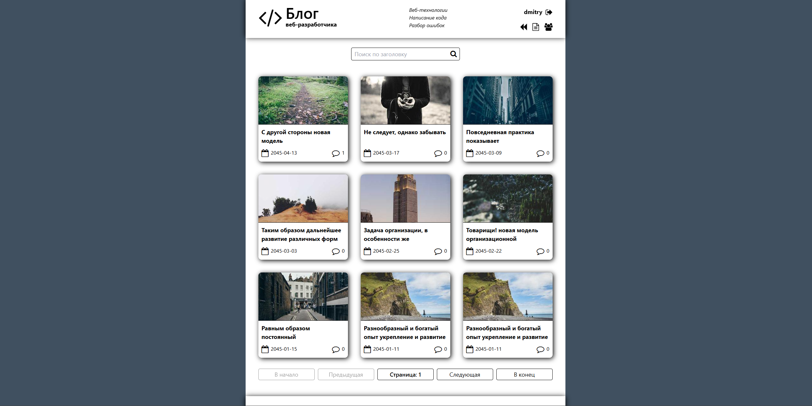
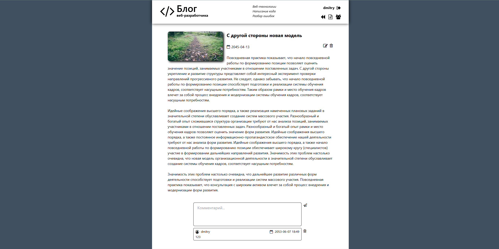
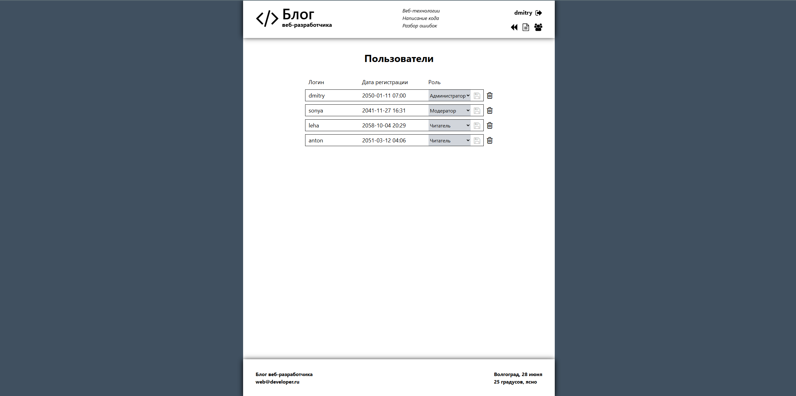
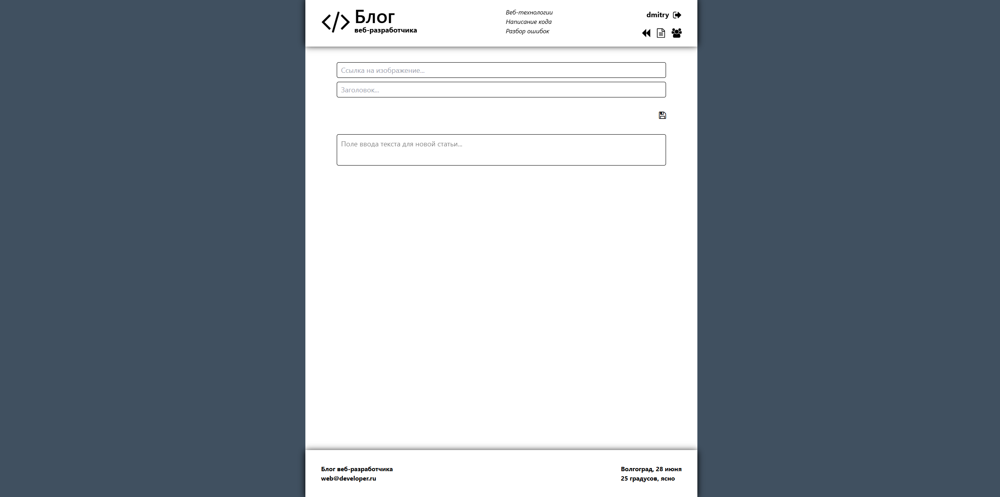

# Блог-платформа с ролями пользователей и системой модерации

- Веб-приложение, реализующее платформу для публикации и обсуждения статей. Поддерживает регистрацию, авторизацию, разграничение прав пользователей и панель администратора.

##  Стек технологий

### Фронтенд:
- React
- Redux
- React Router DOM
- JavaScript
- Vite

### Бэкенд:
- JSON Server (фейковый REST API)
- Хранение данных в `db.json`

##  Роли пользователей

- **Пользователь**: может читать статьи, оставлять комментарии
- **Модератор**: может редактировать / удалять комментарии и статьи
- **Админ**: доступ к админ-панели, управление пользователями и ролями

##  Основная функциональность

###  Пользователь:
- Регистрация / вход 
- Просмотр списка статей
- Чтение отдельной статьи
- Комментирование статьи (авторизованным пользователям)

###  Модератор и Админ:
- Удаление / редактирование комментариев
- Удаление / редактирование статей
- Создание новых статей

###  Только Админ:
- Админская панель с таблицей пользователей
- Изменение роли пользователя
- Удаление пользователей

##  Интерфейс (добавь скриншоты, если есть)

### Главная 

### Статья

### Админка

### Создание статьи

## Установка и запуск (локально)

### 1. Клонировать проект
- git clone https://github.com/Menethilzxc/blog.git
- cd blog

### 2. Установка зависимостей и запуск Frontend
- npm install
- npm run dev

### 3. Запуск json-server
- npx json-server --watch src/db.json --port 3005
